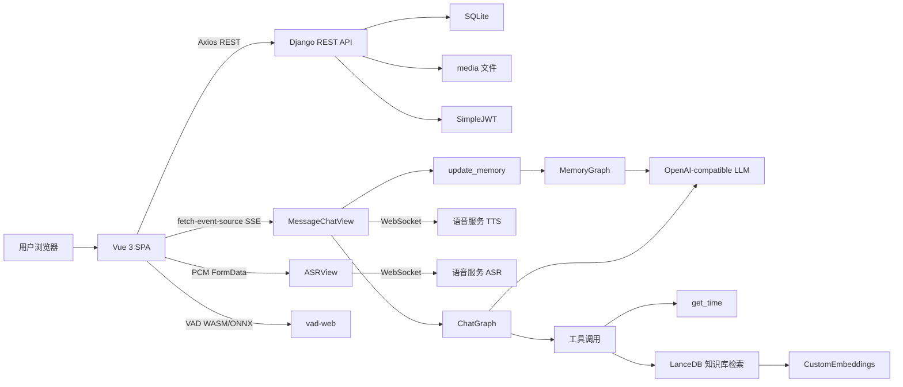
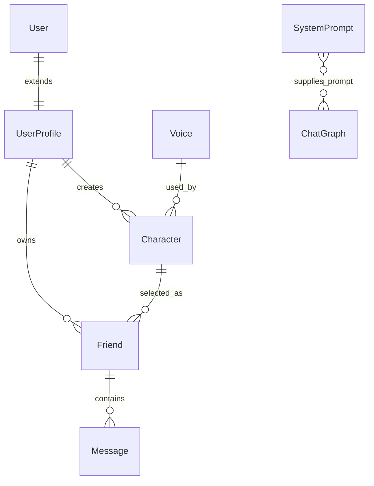
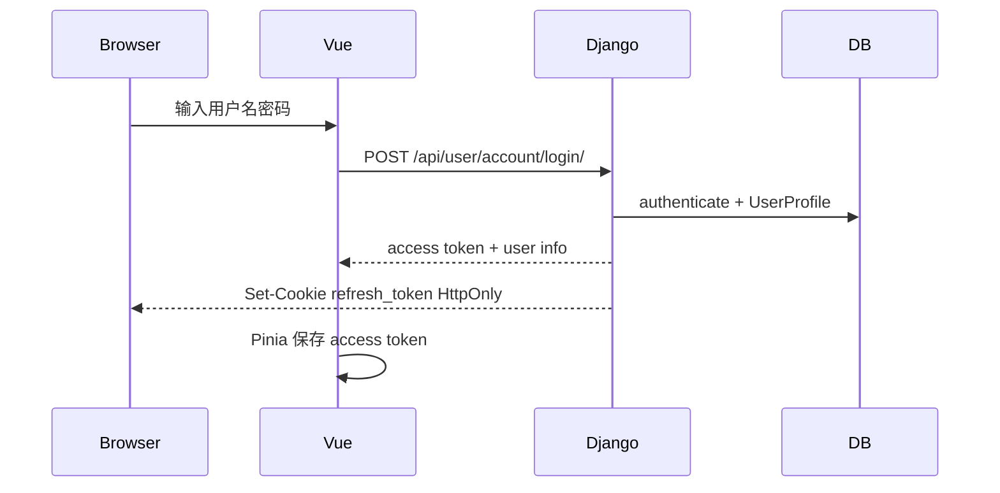

# AIFriends

> AIFriends 是一个“AI 角色社交与陪伴聊天”项目：
> 用户可以注册登录、创建带头像/背景/音色/人设的 AI 角色，在首页浏览或搜索角色，和角色建立自己的 Friend 会话关系，然后通过文字或语音与角色进行流式对话。后端会把角色人设、长期记忆、最近聊天历史、工具调用和知识库检索组合进 LangGraph Agent，并通过 SSE 同时把文本和 TTS 音频片段流式推给前端。

定位为：
- 一个前后端分离的 AI 应用平台。
- 一个带用户体系、UGC 角色体系、私有会话状态、长期记忆、RAG 检索和语音交互的完整业务闭环。
- 一个可以重点讲“流式 AI 交互、登录态续期、RAG、语音 ASR/TTS、前端无限滚动、文件上传裁剪、Django 权限校验”的项目。

## 1. 项目结构

项目主体由两部分组成：

- `backend/`：Django 6 + Django REST Framework 后端，负责账号、角色、好友关系、消息历史、AI Agent、记忆更新、ASR、TTS、静态资源和媒体文件。
- `frontend/`：Vue 3 + Vite 前端，负责页面路由、状态管理、角色列表、登录注册、角色创建、聊天弹窗、SSE 流式接收、浏览器端 VAD 语音检测和音频播放。

AI 能力主要由这些模块支撑：

- `langchain-openai`：以 OpenAI-compatible API 调用大模型和 Embedding。
- `langgraph`：构建带工具调用的 Agent 图。
- `lancedb`：本地向量库，用于知识库检索。
- `websockets`：连接语音服务 WebSocket，实现实时 ASR 和 TTS。
- `@microsoft/fetch-event-source`：前端接收后端 SSE 流。
- `@ricky0123/vad-web`：前端语音活动检测，自动截取用户语音。

## 2. 技术栈总览

| 层级 | 技术 | 当前项目中的作用 |
| --- | --- | --- |
| 前端框架 | Vue 3 | SPA 页面、组合式 API、组件化 UI |
| 构建工具 | Vite 7 | 本地开发、打包输出到 Django 静态目录 |
| 路由 | Vue Router 4 | 首页、好友页、创建页、用户页、登录注册页 |
| 状态管理 | Pinia 3 | 保存用户信息、access token、登录态初始化状态 |
| UI/CSS | Tailwind CSS 4 + DaisyUI 5 | 页面布局、按钮、卡片、抽屉导航、聊天气泡 |
| HTTP | Axios | 普通 REST 请求、请求拦截、响应 401 刷新 token |
| SSE | fetch-event-source | 聊天文本和音频片段的流式接收 |
| 图片处理 | Croppie | 用户头像、角色头像、聊天背景裁剪 |
| 语音检测 | vad-web + ONNX/WASM | 浏览器端检测说话开始/结束并生成 PCM |
| 后端框架 | Django 6 | Web 服务、ORM、模板、静态资源、媒体文件 |
| API 框架 | DRF | APIView、Response、权限控制 |
| 认证 | SimpleJWT | access token + refresh token 登录态 |
| 数据库 | SQLite | 本地开发数据库 |
| AI 编排 | LangGraph | Agent 图、工具调用、记忆更新图 |
| LLM 接入 | LangChain OpenAI | 调用 `deepseek-v3.2` 等 OpenAI-compatible 模型 |
| 向量库 | LanceDB | 本地知识库表 `my_knowledge_base` |
| Embedding | OpenAI SDK | 调用 `text-embedding-v4` 生成 1024 维向量 |
| 语音通信 | websockets | 连接 ASR/TTS 语音服务 |
| 环境变量 | python-dotenv | 加载 API 密钥和服务地址，本文档未读取 `.env` |

## 3. 目录结构

仓库核心结构如下，已省略 `.git`、`.venv`、缓存、构建细节和 `.env*`：

```text
AIFriends/
├── README.md
├── requirements.txt
├── backend/
│   ├── manage.py
│   ├── db.sqlite3
│   ├── backend/
│   │   ├── settings.py
│   │   ├── urls.py
│   │   ├── asgi.py
│   │   └── wsgi.py
│   ├── media/
│   │   ├── character/
│   │   └── user/
│   ├── static/
│   │   └── frontend/
│   │       ├── assets/
│   │       └── vad/
│   └── web/
│       ├── models/
│       │   ├── user.py
│       │   ├── character.py
│       │   └── friend.py
│       ├── views/
│       │   ├── user/
│       │   ├── create/
│       │   ├── friend/
│       │   ├── homepage/
│       │   └── utils/
│       ├── documents/
│       │   ├── data.txt
│       │   ├── lancedb_storage/
│       │   └── utils/
│       ├── migrations/
│       ├── templates/
│       ├── urls.py
│       └── admin.py
└── frontend/
    ├── package.json
    ├── vite.config.js
    ├── index.html
    ├── public/
    │   └── vad/
    └── src/
        ├── main.js
        ├── App.vue
        ├── assets/main.css
        ├── router/index.js
        ├── stores/user.js
        ├── js/
        │   ├── config/config.js
        │   ├── http/api.js
        │   ├── http/streamApi.js
        │   └── utils/base64_to_file.js
        ├── components/
        │   ├── navbar/
        │   └── character/
        └── views/
            ├── homepage/
            ├── friend/
            ├── create/
            ├── user/
            └── error/
```

几个目录特别重要：

- `backend/web/models/`：核心数据表定义。
- `backend/web/views/friend/message/chat/`：AI 聊天主链路。
- `backend/web/views/friend/message/memory/`：长期记忆更新链路。
- `backend/web/views/friend/message/asr/`：语音转文字。
- `backend/web/documents/`：RAG 知识库原文、向量库和 Embedding 工具。
- `frontend/src/js/http/`：普通 API 和流式 API 封装。
- `frontend/src/components/character/chat_field/`：聊天弹窗、历史记录、输入框、语音输入。
- `frontend/public/vad/`：浏览器端 VAD 需要的 ONNX/WASM 资源。

## 4. 总体架构



典型请求链路：

1. 用户访问 Vue 页面，Django 可以作为静态资源服务器承载构建后的 SPA。
2. 用户登录后拿到短期 `access token`，`refresh token` 写入 HttpOnly Cookie。
3. 普通业务请求通过 Axios 发给 DRF API。
4. 聊天请求通过 SSE 发给 `MessageChatView`。
5. 后端组装系统提示词、角色人设、长期记忆和最近聊天历史。
6. LangGraph 调用模型，模型必要时调用工具，比如当前时间和知识库检索。
7. 后端把模型 token 片段一边推给 TTS WebSocket，一边通过 SSE 推给前端。
8. 前端实时追加文本，同时把 base64 音频片段转为 `Uint8Array`，用 MediaSource 播放。
9. 对话结束后后端保存 Message，并触发长期记忆更新。

## 6. 数据模型

### 6.1 ER 关系



### 6.2 表说明

#### User

使用 Django 内置 `django.contrib.auth.models.User`。

主要字段：

- `id`
- `username`
- `password`
- Django 内置认证相关字段

项目没有自定义 User，而是通过 `UserProfile` 做一对一扩展。

#### UserProfile

位置：`backend/web/models/user.py`

作用：保存用户展示资料。

字段：

- `user`：一对一关联 Django User。
- `photo`：用户头像，默认 `user/photos/default.png`。
- `profile`：用户简介，最长 500。
- `create_time`
- `update_time`

头像上传路径通过 `photo_upload_to()` 生成，文件名使用 UUID 前缀避免冲突。

#### Voice

位置：`backend/web/models/character.py`

作用：保存可选音色。

字段：

- `name`：前端展示名称。
- `voice_id`：传给 TTS 服务的音色 ID。
- `create_time`

角色创建和更新时必须选择 `Voice`。

#### Character

位置：`backend/web/models/character.py`

作用：用户创建的 AI 角色模板。

字段：

- `author`：创建者，关联 UserProfile。
- `name`：角色名，最长 50。
- `photo`：角色头像。
- `voice`：角色音色，可为空，但创建接口会按 `voice_id` 查询。
- `profile`：角色人设，最长 100000。
- `background_image`：聊天背景图。
- `create_time`
- `update_time`

角色的头像和背景图都保存在 `backend/media/character/` 下。

#### Friend

位置：`backend/web/models/friend.py`

作用：用户和某个 Character 之间的私有会话关系。

字段：

- `me`：当前用户的 UserProfile。
- `character`：正在聊天的角色。
- `memory`：这个用户与这个角色之间的长期记忆，最长 5000。
- `create_time`
- `update_time`

这是项目里很关键的抽象：`Character` 是公开角色模板，`Friend` 是某个用户和这个角色之间的私人关系状态。这样同一个角色可以被很多用户使用，但每个用户都有自己的聊天历史和长期记忆。

#### Message

位置：`backend/web/models/friend.py`

作用：保存一轮用户输入和 AI 输出。

字段：

- `friend`：所属 Friend。
- `user_message`：用户原始消息，最长 500。
- `input`：实际送入模型的上下文快照，最长 10000。
- `output`：AI 输出摘要或截断保存，最长 500。
- `input_tokens`
- `output_tokens`
- `total_tokens`
- `create_time`

这里既保存用户可见的历史，也保存模型输入和 token 使用量，便于后续排查效果和成本。

#### SystemPrompt

位置：`backend/web/models/friend.py`

作用：在后台配置系统提示词。

字段：

- `title`：提示词类型，例如代码中用到了 `回复` 和 `记忆`。
- `order_number`：同一类型下的拼接顺序。
- `prompt`：提示词内容。
- `create_time`
- `update_time`

聊天时读取 `title='回复'` 的 prompt；记忆更新时读取 `title='记忆'` 的 prompt。

## 7. 后端模块详解

### 7.1 Django 配置

位置：`backend/backend/settings.py`

关键配置：

- `load_dotenv()`：启动时加载环境变量。本文档没有读取 `.env`。
- `INSTALLED_APPS`：包含 `rest_framework`、`web`、`corsheaders`。
- `DATABASES`：SQLite，数据库文件是 `backend/db.sqlite3`。
- `REST_FRAMEWORK`：默认使用 SimpleJWT 的 JWTAuthentication。
- `SIMPLE_JWT`：
  - access token 有效期 2 小时。
  - refresh token 有效期 7 天。
  - 开启 refresh token rotate。
- `CORS_ALLOWED_ORIGINS`：允许 `http://localhost:5173`。
- `MEDIA_ROOT`：`backend/media`。
- `MEDIA_URL`：
  - DEBUG 下是 `http://127.0.0.1:8000/media/`。
  - 非 DEBUG 下是云端域名。
- `STATICFILES_DIRS` 或 `STATIC_ROOT`：根据 DEBUG 切换。

面试可讲点：

- 为什么用 JWT：前后端分离下服务端不需要维护传统 Session，前端每次请求带 Bearer token。
- 为什么 refresh token 放 HttpOnly Cookie：降低 XSS 读取 refresh token 的风险。
- 为什么 access token 放前端状态：请求头携带方便，但需要注意 XSS 风险和刷新策略。
- 为什么 Vite 打包到 Django static：可以让 Django 在部署时直接承载 SPA。

### 7.2 URL 路由

根路由：`backend/backend/urls.py`

- `/admin/`：Django Admin。
- `/`：include `web.urls`。
- DEBUG 下额外暴露 `/assets/` 和 `/media/`。

业务路由：`backend/web/urls.py`

主要 API：

- 用户账号：登录、注册、登出、刷新 token、获取用户信息。
- 用户资料：更新头像、昵称、简介。
- 角色创建：创建、更新、删除、获取单个、获取列表、获取音色列表。
- 首页：角色搜索和分页加载。
- 好友：获取或创建 Friend、删除 Friend、获取 Friend 列表。
- 消息：聊天、历史记录、ASR。
- SPA fallback：除 media/static/assets 外的路径全部回落到 `index`，让 Vue Router 接管。

### 7.3 账号与认证

相关文件：

- `backend/web/views/user/account/login.py`
- `backend/web/views/user/account/register.py`
- `backend/web/views/user/account/refresh_token.py`
- `backend/web/views/user/account/logout.py`
- `backend/web/views/user/account/get_user_info.py`

登录流程：

1. 前端提交用户名和密码。
2. 后端使用 Django `authenticate()` 验证。
3. 验证成功后读取 `UserProfile`。
4. 通过 `RefreshToken.for_user(user)` 生成 refresh/access token。
5. access token 放在 JSON 响应中。
6. refresh token 写入 `refresh_token` Cookie，设置 `httponly=True`、`samesite='Lax'`、`secure=True`。
7. 前端把 access token 放入 Pinia store。

注册流程：

1. 检查用户名和密码不能为空。
2. 检查用户名是否已存在。
3. `User.objects.create_user()` 创建 Django User。
4. 创建对应的 `UserProfile`。
5. 同登录流程一样返回 token 和用户资料。

刷新流程：

1. 后端从 Cookie 中读取 `refresh_token`。
2. 使用 SimpleJWT 解析 refresh token。
3. 如果开启 rotate，则重设 jti，并返回新的 access token 和 refresh token Cookie。
4. 如果失败，返回 401。

登出流程：

1. 需要 `IsAuthenticated`。
2. 删除 `refresh_token` Cookie。
3. 前端清空 Pinia 用户状态。

面试可讲点：

- refresh token 不暴露给 JS，access token 只短期存在前端内存。
- Axios 拦截器统一处理 401，避免页面层重复写刷新逻辑。
- 当前实现没有引入 refresh token blacklist app，`BLACKLIST_AFTER_ROTATION` 在生产中需要确认是否安装并迁移对应 blacklist 应用。

### 7.4 用户资料

位置：`backend/web/views/user/profile/update.py`

功能：

- 需要登录。
- 支持更新用户名、简介、头像。
- 用户名变更时检查唯一性。
- 上传新头像时通过 `remove_old_photo()` 删除旧头像。
- 更新后返回最新用户资料，前端同步 Pinia store。

前端位置：

- `frontend/src/views/user/profile/ProfileIndex.vue`
- `frontend/src/views/user/profile/components/Photo.vue`
- `frontend/src/views/user/profile/components/Username.vue`
- `frontend/src/views/user/profile/components/Profile.vue`

前端图片处理：

- 使用 Croppie 裁剪头像。
- 将 base64 转为 File 后放入 FormData。

### 7.5 角色管理

后端文件：

- `backend/web/views/create/character/create.py`
- `backend/web/views/create/character/update.py`
- `backend/web/views/create/character/remove.py`
- `backend/web/views/create/character/get_list.py`
- `backend/web/views/create/character/get_single.py`
- `backend/web/views/create/character/voice/get_list.py`

创建角色：

- 需要登录。
- 表单字段包括：
  - `name`
  - `profile`
  - `voice_id`
  - `photo`
  - `background_image`
- 后端通过当前登录用户找到 `UserProfile`。
- 根据 `voice_id` 查询 `Voice`。
- 创建 `Character`。

更新角色：

- 需要登录。
- 用 `Character.objects.get(id=character_id, author__user=request.user)` 做归属校验。
- 允许更新名称、人设、音色、头像、背景图。
- 如果上传了新图，会删除旧图。

删除角色：

- 需要登录。
- 只允许删除自己创建的角色。
- 删除前清理头像和背景图。

获取角色列表：

- `get_list` 根据 `user_id` 查某个用户创建的角色，用 `items_count` 做偏移分页，每次最多 20 条。
- `homepage/index` 可以按角色名或人设搜索，使用 `Q(name__icontains=...) | Q(profile__icontains=...)`。

前端位置：

- `frontend/src/views/create/character/CreateCharacter.vue`
- `frontend/src/views/create/character/UpdateCharacter.vue`
- `frontend/src/views/create/character/components/`
- `frontend/src/components/character/Character.vue`

前端交互：

- 创建和更新页面由多个表单组件组成，通过 `useTemplateRef` 获取子组件暴露的值。
- 头像和背景图都使用 Croppie 裁剪。
- 成功后跳转到当前用户个人空间。
- 角色卡片支持：
  - 点击打开聊天弹窗。
  - 作者本人可编辑和删除。
  - 好友列表中可移除 Friend。

### 7.6 好友关系

后端文件：

- `backend/web/views/friend/get_or_create.py`
- `backend/web/views/friend/get_list.py`
- `backend/web/views/friend/remove.py`

核心设计：

用户点击某个 Character 聊天时，并不是直接创建 Message，而是先调用 `get_or_create`：

1. 根据 `character_id` 和当前用户查找 Friend。
2. 如果已经存在，直接返回。
3. 如果不存在，创建新的 Friend。
4. 返回 Friend 和 Character 信息。

这样可以把“公开角色模板”和“私人会话关系”分离。

前端位置：

- `frontend/src/components/character/Character.vue`
- `frontend/src/views/friend/FriendIndex.vue`

好友列表：

- 按 `update_time` 倒序排列。
- 使用 `items_count` 做偏移分页。
- 前端用 IntersectionObserver 做无限滚动。

### 7.7 消息历史

后端文件：`backend/web/views/friend/message/get_history.py`

功能：

- 需要登录。
- 参数：
  - `friend_id`
  - `last_message_id`
- 查询时加上 `friend__me__user=request.user`，防止越权读取别人的历史。
- 每次返回最近 10 条。
- 如果 `last_message_id > 0`，则查询更早的消息。

前端位置：`frontend/src/components/character/chat_field/chat_history/ChatHistory.vue`

前端实现细节：

- 顶部放一个 sentinel。
- IntersectionObserver 监听 sentinel 是否进入可视区。
- 进入可视区时加载更早的消息。
- 插入历史消息后，用旧高度和新高度计算 scrollTop，避免用户视角跳动。
- 历史消息会按 user/ai 两条气泡插入。

面试可讲点：

- 聊天历史加载不是一次性全量，而是向上翻页。
- 前端在 prepend 老消息时维护滚动位置，这是聊天产品常见细节。

### 7.8 AI 聊天主链路

核心文件：

- `backend/web/views/friend/message/chat/chat.py`
- `backend/web/views/friend/message/chat/graph.py`

入口：`MessageChatView.post()`

流程：

1. 验证用户登录。
2. 读取 `friend_id` 和 `message`。
3. 校验消息非空。
4. 查询 Friend，条件包含 `me__user=request.user`，防止越权。
5. 创建 LangGraph app。
6. 构造初始输入：
   - 当前用户消息：`HumanMessage(message)`。
7. 调用 `add_system_prompt()`：
   - 读取 `SystemPrompt.title='回复'` 的提示词并按 `order_number` 拼接。
   - 追加角色人设：`friend.character.profile`。
   - 追加长期记忆：`friend.memory`。
8. 调用 `add_recent_messages()`：
   - 读取最近 10 条 Message。
   - 转成 HumanMessage 和 AIMessage。
   - 插入到当前消息之前。
9. 返回 `StreamingHttpResponse`，content type 是 `text/event-stream`。
10. 在后台线程中同时执行模型流式输出和 TTS WebSocket。
11. SSE 持续返回：
    - `{ "content": "..." }`
    - `{ "audio": "base64..." }`
12. 对话结束后返回 `data: [DONE]`。
13. 保存 Message。
14. 触发 `update_memory(friend)`。

### 7.9 ChatGraph

位置：`backend/web/views/friend/message/chat/graph.py`

Graph 结构：

```text
START -> agent -> should_continue
                 ├── tool_calls 存在 -> tools -> agent
                 └── 无 tool_calls -> END
```

Agent 使用：

- `ChatOpenAI`
- model: `deepseek-v3.2`
- `streaming=True`
- `stream_options.include_usage=True`

绑定工具：

#### get_time

作用：当用户询问精确时间时返回当前本地时间。

实现：

- 使用 Django `localtime(now())`
- 格式：`%Y-%m-%d %H:%M:%S`

#### search_knowledge_base

作用：当用户询问阿里云百炼平台相关信息时查询本地知识库。

实现：

1. 连接 `./web/documents/lancedb_storage`。
2. 使用 `CustomEmbeddings`。
3. 打开 LanceDB 表 `my_knowledge_base`。
4. 对 query 做 similarity search，top k = 3。
5. 把片段拼接后返回给模型。

面试可讲点：

- 这是一个很小但完整的 ReAct/tool-calling Agent。
- 工具不是前端直接调用，而是模型根据上下文决定是否调用。
- RAG 工具把结构化外部知识补进模型上下文，减少模型凭空回答。

### 7.10 SSE + TTS 双流设计

位置：`backend/web/views/friend/message/chat/chat.py`

这是项目最有技术亮点的部分。

后端需要同时做三件事：

1. 从 LLM 流式读取文本 token。
2. 把文本 token 继续发给 TTS WebSocket。
3. 把文本 token 和 TTS 返回的二进制音频都通过 SSE 发给浏览器。

实现方式：

- `event_stream()` 是 Django 的同步生成器，用来 yield SSE。
- 后台开一个 `threading.Thread`。
- 线程里用 `asyncio.run()` 执行异步 TTS 任务。
- 异步任务内部用 `asyncio.gather()` 同时运行：
  - `tts_sender()`：从 LangGraph `app.astream()` 读模型消息，把文本发给 TTS，同时把文本放入 Queue。
  - `tts_receiver()`：从 TTS WebSocket 读音频 bytes，把 bytes base64 后放入 Queue。
- 同步生成器从 Queue 里取消息，转成 SSE。

为什么需要 Queue：

- Django StreamingHttpResponse 是同步迭代器。
- LLM 和 TTS 是异步 WebSocket/async stream。
- Queue 用来在同步世界和异步世界之间传递事件。

前端处理：

- 文本：追加到最后一条 AI 消息。
- 音频：base64 解码成 Uint8Array，放入 MediaSource SourceBuffer。

面试可讲点：

- 这个设计实现了“边生成文本、边合成语音、边播放音频”。
- 相比等模型整段输出完再 TTS，首包延迟更低，用户感知更接近实时。
- 当前实现每个聊天请求会占用一个线程，生产环境需要考虑 ASGI、任务队列或专门的流式服务。

### 7.11 长期记忆更新

核心文件：

- `backend/web/views/friend/message/memory/update.py`
- `backend/web/views/friend/message/memory/graph.py`

设计目标：

- 不把所有历史消息都塞进每次对话上下文。
- 用 Friend.memory 保存“用户和这个角色之间长期稳定的信息”。
- 每轮对话结束后由模型总结更新 memory。

流程：

1. `update_memory(friend)` 创建 MemoryGraph。
2. `create_system_message()` 读取 `SystemPrompt.title='记忆'` 的提示词。
3. `create_human_message(friend)` 拼接：
   - 原始记忆：`friend.memory`
   - 最近对话：Message 中的用户消息和 AI 输出。
4. 调用模型。
5. 将模型最后一条消息写回 `friend.memory`。
6. 更新 Friend 的 `update_time`。

MemoryGraph 结构：

```text
START -> agent -> END
```

也就是一个单节点总结图。

面试可讲点：

- 短期上下文用最近 10 条消息，长期状态用 memory。
- 这样可以控制上下文长度，同时让角色“记住”用户偏好和历史。
- 后续可以做异步化、周期化、增量记忆、记忆质量评估和人工可编辑记忆。

### 7.12 ASR 语音转文字

后端文件：`backend/web/views/friend/message/asr/asr.py`

前端文件：`frontend/src/components/character/chat_field/input_field/Microphone.vue`

前端流程：

1. 用户切换到语音输入模式。
2. `MicVAD.new()` 加载 VAD 模型和 WASM。
3. `onSpeechStart`：
   - 显示正在说话状态。
   - 通知父组件停止当前音频播放。
4. `onSpeechEnd(audio)`：
   - VAD 返回 Float32Array。
   - 前端转为 PCM 16-bit。
   - 通过 FormData 上传到 `/api/friend/message/asr/asr/`。
5. 后端返回识别文本后，前端把文本作为聊天消息发送。

后端流程：

1. 接收 `audio` 文件。
2. 读取 PCM bytes。
3. 建立语音服务 WebSocket。
4. 发送 `run-task`，模型是 `gummy-realtime-v1`。
5. `asr_sender()` 分块发送 PCM，每块 3200 bytes。
6. `asr_receiver()` 监听 `result-generated`。
7. 收到 `sentence_end` 后拼接转写文本。
8. task finished 后返回文本。

面试可讲点：

- VAD 放在前端可以减少无效音频上传。
- 语音上传是 PCM 而不是浏览器原始格式，后端和语音服务参数更可控。
- 识别结束后复用文字聊天链路，业务复杂度更低。

### 7.13 TTS 文字转语音

位置：`backend/web/views/friend/message/chat/chat.py`

TTS 设计：

- 通过 WebSocket 连接语音服务。
- 使用模型 `cosyvoice-v3-flash`。
- 使用角色绑定的 `friend.character.voice.voice_id`。
- 输出格式是 mp3。
- sample rate 是 22050。
- volume/rate/pitch 在代码中写死。

关键动作：

- `run-task`：初始化 TTS 任务。
- `continue-task`：持续发送 LLM 生成的文本片段。
- `finish-task`：结束文本输入。

前端播放：

- 使用 `new Audio()`。
- 使用 `MediaSource` 和 `SourceBuffer('audio/mpeg')`。
- 每个 base64 音频片段解码后放入队列。
- SourceBuffer `updateend` 后继续 append 下一块。

面试可讲点：

- 这是浏览器里播放流式音频的常见方式。
- 如果直接创建很多 Blob URL，会有播放衔接和内存管理问题。
- 当前实现有 `stopAudio()` 和 `onUnmounted()` 释放资源。

### 7.14 RAG 知识库

核心文件：

- `backend/web/documents/utils/custom_embeddings.py`
- `backend/web/documents/utils/insert_document.py`
- `backend/web/views/friend/message/chat/graph.py`

知识库构建：

1. `TextLoader('./web/documents/data.txt', encoding='utf-8')` 读取原文。
2. `RecursiveCharacterTextSplitter(chunk_size=500, chunk_overlap=50)` 切片。
3. `CustomEmbeddings` 调用 Embedding API。
4. 使用 `LanceDB.from_documents()` 写入 `my_knowledge_base` 表。
5. 当前模式是 `overwrite`。

Embedding：

- model: `text-embedding-v4`
- dimensions: 1024
- batch size: 10
- 空字符串会过滤。

检索：

- 工具 `search_knowledge_base(query)` 连接本地 LanceDB。
- similarity search top k = 3。
- 返回片段文本给 Agent。

面试可讲点：

- RAG 的核心是“离线入库 + 在线检索 + 注入上下文”。
- chunk size 和 overlap 会影响召回精度与上下文冗余。
- top k = 3 是召回质量和 token 成本之间的折中。
- 当前工具描述限定在“阿里云百炼平台相关问题”，属于领域知识库。

## 8. 前端模块详解

### 8.1 应用入口

入口文件：`frontend/src/main.js`

流程：

1. 导入 `main.css`。
2. 创建 Vue app。
3. 注册 Pinia。
4. 注册 Vue Router。
5. 挂载到 `#app`。

全局 CSS：`frontend/src/assets/main.css`

```css
@import "tailwindcss";
@plugin "daisyui";
```

说明：项目使用 Tailwind CSS 4 的 CSS-first 配置方式，并通过 DaisyUI 提供组件类。

### 8.2 App 初始化

位置：`frontend/src/App.vue`

核心逻辑：

- 页面挂载后调用 `/api/user/account/get_user_info/`。
- 如果成功，写入 Pinia 用户资料。
- 无论成功失败，都会设置 `hasPulledUserInfo=true`。
- 如果当前路由需要登录但用户未登录，则跳转登录页。
- 页面布局使用 `NavBar` 包裹 `RouterView`。

面试可讲点：

- 刷新页面时 Pinia 内存状态会丢失，所以 App 启动时必须向后端确认登录态。
- 路由守卫还需要等待“是否已经拉取用户信息”这个状态，避免刚刷新时误判未登录。

### 8.3 路由

位置：`frontend/src/router/index.js`

路由表：

| 路径 | 组件 | 登录要求 | 作用 |
| --- | --- | --- | --- |
| `/` | HomepageIndex | 否 | 首页角色流和搜索 |
| `/friend/` | FriendIndex | 是 | 我的好友/会话角色 |
| `/create/` | CreateIndex | 是 | 创建角色 |
| `/create/character/update/:character_id/` | UpdateCharacter | 是 | 更新角色 |
| `/404/` | NotFoundIndex | 否 | 404 页面 |
| `/user/account/login/` | LoginIndex | 否 | 登录 |
| `/user/account/register/` | RegisterIndex | 否 | 注册 |
| `/user/space/:user_id/` | SpaceIndex | 否 | 用户个人空间 |
| `/user/profile/` | ProfileIndex | 是 | 编辑资料 |
| `/:pathMatch(.*)*` | NotFoundIndex | 否 | 前端兜底 404 |

路由守卫：

- 如果 `to.meta.needLogin` 为 true。
- 并且已经完成用户信息拉取。
- 并且用户没有登录。
- 则跳转登录页。

### 8.4 Pinia 用户状态

位置：`frontend/src/stores/user.js`

保存：

- `id`
- `username`
- `photo`
- `profile`
- `accessToken`
- `hasPulledUserInfo`

方法：

- `isLogin()`：判断是否有 access token。
- `setAccessToken(token)`：保存 access token。
- `setUserInfo(data)`：保存用户资料。
- `logout()`：清空用户状态。
- `setHasPulledUserInfo(newStatus)`：标记登录态初始化完成。

面试可讲点：

- 用户状态只放在内存中，刷新后需要重新向后端确认。
- refresh token 在 HttpOnly Cookie 中，JS 不能直接读取。

### 8.5 Axios 请求封装

位置：`frontend/src/js/http/api.js`

功能：

- 创建带 `baseURL` 和 `withCredentials=true` 的 Axios 实例。
- 请求拦截器自动加：
  - `Authorization: Bearer <accessToken>`
- 响应拦截器处理 401：
  - 如果 access token 过期，用 refresh token 请求 `/api/user/account/refresh_token/`。
  - 刷新成功后重放原请求。
  - 刷新失败则 `user.logout()`。

并发刷新处理：

- `isRefreshing` 标记是否正在刷新。
- `refreshSubscribers` 队列保存等待中的请求。
- 第一个 401 发起刷新。
- 后续 401 请求订阅刷新结果，而不是重复发刷新请求。

面试可讲点：

- 这能避免“多个请求同时 401 导致 refresh 风暴”。
- 原请求通过 `_retry` 防止无限循环。
- refresh 请求使用裸 `axios.post`，避免被当前实例拦截器影响。

### 8.6 SSE 请求封装

位置：`frontend/src/js/http/streamApi.js`

为什么需要单独封装：

- Axios 更适合普通 JSON，不适合浏览器端 SSE 流。
- 聊天接口是 `text/event-stream`，需要逐条处理 `onmessage`。

核心能力：

- 使用 `fetchEventSource(BASE_URL + url, ...)`。
- 请求头带 access token。
- 请求体 JSON.stringify。
- `openWhenHidden=true`，避免页面隐藏时浏览器强制关闭。
- `onopen()` 中处理：
  - 401 时调用普通 api 刷新 token。
  - 响应非 event-stream 时抛错。
- `onmessage()` 中处理：
  - `[DONE]` 作为结束信号。
  - 其他消息 JSON.parse 后交给上层。
- `onerror()` 中处理 token refresh 后重试。

面试可讲点：

- SSE 和普通 REST 的错误处理不同，所以拆成独立封装。
- 流式请求中的 token 过期要在 `onopen` 阶段处理。

### 8.7 API 地址配置

位置：`frontend/src/js/config/config.js`

当前配置有三个环境：

- `vue`：前端本地 Vite + 后端本地 Django。
- `django`：Django 本地承载构建后的前端。
- `cloud`：云端域名。

当前代码中 `platform = 'cloud'`。

本地开发时通常要改为：

```js
const platform = 'vue'
```

否则前端请求会发到云端域名。

### 8.8 导航栏

位置：

- `frontend/src/components/navbar/NavBar.vue`
- `frontend/src/components/navbar/UserMenu.vue`

功能：

- Drawer 侧边导航。
- 顶部搜索框。
- 登录入口。
- 创建入口。
- 用户头像下拉菜单。
- 跳转个人空间、编辑资料、退出登录。

搜索逻辑：

- 用户提交搜索后跳转首页并设置 query 参数 `q`。
- 首页监听 `route.query.q` 变化，重置列表并重新拉取。

### 8.9 首页角色流

位置：`frontend/src/views/homepage/HomepageIndex.vue`

功能：

- 拉取 `/api/homepage/index/`。
- 参数：
  - `items_count`
  - `search_query`
- 使用 IntersectionObserver 实现无限滚动。
- 每次加载 20 个角色。
- 搜索 query 改变时重置列表。

### 8.10 个人空间

位置：`frontend/src/views/user/space/SpaceIndex.vue`

功能：

- 根据 `route.params.user_id` 拉取某个用户的资料和角色列表。
- 接口：`/api/create/character/get_list/`。
- 支持无限滚动。
- 如果是自己的角色，可以编辑和删除。

### 8.11 好友页

位置：`frontend/src/views/friend/FriendIndex.vue`

功能：

- 拉取当前登录用户的 Friend 列表。
- 接口：`api/friend/get_list/`。
- 支持无限滚动。
- 每个 Friend 以 Character 卡片展示。
- 可以移除好友关系。

### 8.12 角色卡片与聊天弹窗

角色卡片：`frontend/src/components/character/Character.vue`

能力：

- 展示背景图、头像、名称、人设、作者信息。
- 作者本人可编辑/删除。
- 好友列表中可移除好友。
- 点击卡片后：
  - 未登录则跳转登录页。
  - 已登录则调用 `/api/friend/get_or_create/`。
  - 拿到 Friend 后打开 ChatField 弹窗。

聊天弹窗：`frontend/src/components/character/chat_field/ChatField.vue`

能力：

- 使用 `<dialog>` 显示模态框。
- 背景图使用角色 `background_image`。
- 包含：
  - ChatHistory
  - InputField
  - CharacterPhotoField
- 维护当前弹窗内的 `history` 数组。
- 向子组件暴露 `showModal()`。

### 8.13 输入框与流式聊天

位置：`frontend/src/components/character/chat_field/input_field/InputField.vue`

文字输入流程：

1. 用户提交输入。
2. 初始化音频流播放环境。
3. 使用 `processId` 标记当前请求。
4. 先往 history 里插入：
   - 用户消息。
   - 空 AI 消息。
5. 调用 `streamApi('/api/friend/message/chat/', ...)`。
6. 收到 `content` 时追加到最后一条 AI 消息。
7. 收到 `audio` 时调用 `handleAudioChunk()`。
8. 用户停止或关闭弹窗时递增 `processId`，让旧流回调失效，并停止音频。

为什么需要 `processId`：

- 用户可能在上一次流还没结束时关闭弹窗、停止播放或发起下一次输入。
- `processId` 可以让旧请求返回的数据不再影响当前 UI。

音频播放流程：

1. `initAudioStream()` 创建 MediaSource。
2. `sourceopen` 后创建 `SourceBuffer('audio/mpeg')`。
3. 每个 base64 音频片段转成 Uint8Array。
4. 推入 `audioQueue`。
5. SourceBuffer 空闲时 append。
6. `updateend` 后继续处理队列。

### 8.14 语音输入

位置：`frontend/src/components/character/chat_field/input_field/Microphone.vue`

能力：

- 使用 `@ricky0123/vad-web` 进行语音活动检测。
- VAD 资源路径来自 `CONFIG_API.VAD_URL`。
- 参数：
  - `positiveSpeechThreshold: 0.8`
  - `negativeSpeechThreshold: 0.65`
  - `minSpeechFrames: 5`
  - `redemptionFrames: 5`
- 说话开始时通知父组件停止当前播放。
- 说话结束时把 Float32 音频转 PCM 16-bit。
- 上传到后端 ASR。
- 后端返回 text 后，复用文字发送逻辑。

### 8.15 图片裁剪与文件上传

用到 Croppie 的位置：

- 角色头像：`frontend/src/views/create/character/components/Photo.vue`
- 角色背景：`frontend/src/views/create/character/components/BackgroundImage.vue`
- 用户头像：`frontend/src/views/user/profile/components/Photo.vue`

基本流程：

1. 用户选择图片。
2. Croppie 绑定图片。
3. 用户裁剪。
4. 调用 `croppie.result()` 得到 base64。
5. `base64ToFile()` 转成 File。
6. 放入 FormData 提交给后端。
7. 后端用 ImageField 保存到 media。

## 9. API 清单

| 方法 | 路径 | 登录 | 作用 | 主要参数 |
| --- | --- | --- | --- | --- |
| POST | `/api/user/account/login/` | 否 | 登录 | `username`, `password` |
| POST | `/api/user/account/logout/` | 是 | 登出 | 无 |
| POST | `/api/user/account/register/` | 否 | 注册 | `username`, `password` |
| POST | `/api/user/account/refresh_token/` | Cookie | 刷新 access token | `refresh_token` Cookie |
| GET | `/api/user/account/get_user_info/` | 是 | 获取当前用户信息 | 无 |
| POST | `/api/user/profile/update/` | 是 | 更新用户资料 | `username`, `profile`, `photo?` |
| POST | `/api/create/character/create/` | 是 | 创建角色 | `name`, `profile`, `voice_id`, `photo`, `background_image` |
| POST | `/api/create/character/update/` | 是 | 更新角色 | `character_id`, `name`, `profile`, `voice_id`, `photo?`, `background_image?` |
| POST | `/api/create/character/remove/` | 是 | 删除角色 | `character_id` |
| GET | `/api/create/character/get_single/` | 是 | 获取单个角色和音色列表 | `character_id` |
| GET | `/api/create/character/get_list/` | 否 | 获取某用户角色列表 | `user_id`, `items_count` |
| GET | `/api/create/character/voice/get_list/` | 是 | 获取音色列表 | 无 |
| GET | `/api/homepage/index/` | 否 | 首页角色列表和搜索 | `items_count`, `search_query` |
| POST | `/api/friend/get_or_create/` | 是 | 获取或创建 Friend | `character_id` |
| POST | `/api/friend/remove/` | 是 | 删除 Friend | `friend_id` |
| GET | `/api/friend/get_list/` | 是 | 获取 Friend 列表 | `items_count` |
| POST | `/api/friend/message/chat/` | 是 | SSE 聊天 | `friend_id`, `message` |
| GET | `/api/friend/message/get_history/` | 是 | 获取历史消息 | `friend_id`, `last_message_id` |
| POST | `/api/friend/message/asr/asr/` | 是 | 语音转文字 | `audio` |

## 10. 核心业务流程

### 10.1 登录态流程



刷新流程：

```text
API 请求 -> 401 -> Axios 拦截器 -> refresh_token Cookie 刷新 -> 更新 access token -> 重放原请求
```

### 10.2 首页浏览和搜索

```text
NavBar 搜索框
-> router.push({ name: 'homepage-index', query: { q } })
-> HomepageIndex watch route.query.q
-> reset list
-> GET /api/homepage/index/?items_count=0&search_query=q
-> 后端 Q(name__icontains=q | profile__icontains=q)
-> 返回角色列表
-> IntersectionObserver 继续分页
```

### 10.3 创建角色

```text
进入 /create/
-> 拉取音色列表
-> 用户填写名称、人设、音色
-> Croppie 裁剪头像和背景
-> base64ToFile
-> FormData POST /api/create/character/create/
-> 后端校验字段和当前用户
-> Character.objects.create()
-> 跳转用户个人空间
```

### 10.4 打开聊天

```text
点击 Character 卡片
-> 未登录：跳登录页
-> 已登录：POST /api/friend/get_or_create/
-> 后端查询或创建 Friend
-> 返回 Friend 和 Character
-> ChatField.showModal()
-> ChatHistory 加载历史消息
-> InputField focus
```

### 10.5 文字聊天

```text
用户输入消息
-> 前端插入 user 气泡和空 ai 气泡
-> streamApi POST /api/friend/message/chat/
-> 后端校验 Friend 归属
-> 拼接 SystemPrompt + 角色人设 + 长期记忆 + 最近消息 + 当前消息
-> LangGraph stream
-> 文本片段进入 TTS
-> 文本片段和音频片段进入 Queue
-> SSE 返回 content/audio
-> 前端 content 追加到 AI 气泡
-> 前端 audio append 到 MediaSource 播放
-> [DONE]
-> 后端保存 Message
-> 后端 update_memory
```

### 10.6 语音聊天

```text
用户切到语音模式
-> vad-web 检测 speech start
-> 停止当前播放
-> speech end 后拿到 Float32Array
-> 转 PCM 16-bit
-> POST /api/friend/message/asr/asr/
-> 后端 WebSocket ASR
-> 返回 text
-> 前端把 text 交给 handleSend
-> 复用文字聊天流程
```

### 10.7 知识库检索

```text
用户问题
-> Agent 判断需要工具
-> 调用 search_knowledge_base(query)
-> LanceDB similarity_search top 3
-> 返回片段文本
-> Agent 结合片段生成回答
```

## 11. 本地运行

### 11.1 后端

```bash
pip install -r requirements.txt
cd backend
python manage.py migrate
python manage.py runserver 127.0.0.1:8000
```

可选：

```bash
python manage.py createsuperuser
```

Admin 用途：

- 管理 Voice 音色。
- 管理 SystemPrompt。
- 查看 UserProfile、Character、Friend、Message。

### 11.2 前端

```bash
cd frontend
npm install
npm run dev
```

本地开发前建议把 `frontend/src/js/config/config.js` 中的：

```js
const platform = 'cloud'
```

改成：

```js
const platform = 'vue'
```

然后访问 Vite 地址，一般是：

```text
http://localhost:5173
```

### 11.3 前端构建到 Django

```bash
cd frontend
npm run build
```

根据 `frontend/vite.config.js`，构建产物输出到：

```text
backend/static/frontend
```

Django 通过模板 `backend/web/templates/index.html` 和 fallback 路由承载 SPA。

### 11.4 运行前需要准备的数据

项目能跑完整 AI 链路前，至少需要：

- 环境变量：
  - `API_KEY`
  - `API_BASE`
  - `WSS_URL`
- 数据库中有 Voice：
  - `name`
  - `voice_id`
- 数据库中有 SystemPrompt：
  - `title='回复'`
  - `title='记忆'`
- 如需 RAG：
  - `backend/web/documents/data.txt`
  - 已构建的 `backend/web/documents/lancedb_storage/my_knowledge_base`

## 12. 环境变量说明

代码中引用了这些环境变量：

| 变量 | 用途 |
| --- | --- |
| `API_KEY` | LLM、Embedding、ASR/TTS 服务认证 |
| `API_BASE` | OpenAI-compatible API base URL，用于 LLM 和 Embedding |
| `WSS_URL` | 语音服务 WebSocket 地址，用于 ASR 和 TTS |

注意：

- 本文档没有读取 `.env`。
- 生产环境中 Django `SECRET_KEY`、`DEBUG`、`ALLOWED_HOSTS`、数据库配置也应该改成环境变量管理。

## 13. 面试讲法

### 13.1 30 秒版本

这是一个 AI 角色陪伴聊天平台。我负责/实现了从用户登录、角色创建、好友关系、聊天历史，到 LangGraph Agent、长期记忆、RAG 知识库、ASR/TTS 语音交互的完整链路。前端用 Vue 3、Pinia、Vue Router、Axios 和 SSE，后端用 Django REST Framework、SimpleJWT、LangGraph、LanceDB 和 WebSocket。比较有挑战的是聊天接口同时要流式返回文本和音频，所以后端用异步 WebSocket 连接模型/语音服务，再通过 Queue 桥接到 Django 的 StreamingHttpResponse；前端用 MediaSource 边收边播。

### 13.2 2 分钟版本

项目分为 Vue 前端和 Django 后端。前端负责角色浏览、搜索、无限滚动、登录注册、角色创建和聊天弹窗；后端负责用户、角色、好友关系、消息历史和 AI 能力。

业务上我把 Character 和 Friend 做了拆分：Character 是用户创建的公开角色模板，包含人设、头像、背景图、音色；Friend 是某个用户和某个角色之间的私人关系，保存这个用户独有的长期记忆和消息历史。这使得同一个角色可以被多个用户使用，但每个用户都有独立上下文。

AI 链路上，聊天接口会读取后台配置的系统提示词，再拼接角色人设、长期记忆、最近 10 条对话和当前消息，然后交给 LangGraph Agent。Agent 绑定了两个工具，一个是获取当前时间，一个是查询 LanceDB 知识库。模型输出是流式的，后端把文本 token 同步送给 TTS WebSocket，同时通过 SSE 返回给前端；TTS 返回的音频 bytes 被 base64 后也通过 SSE 返回。前端收到文本就更新聊天气泡，收到音频就通过 MediaSource 追加播放，实现文本和语音同步生成。

认证上使用 SimpleJWT。access token 返回给前端内存，refresh token 放 HttpOnly Cookie。Axios 拦截器自动带 Bearer token，并且对 401 做队列化 refresh，避免多个请求同时过期导致重复刷新。

语音输入上，前端用 vad-web 做语音活动检测，说话结束后把音频转 PCM 16-bit 上传给后端，后端通过 WebSocket 调 ASR 服务拿到文本，然后复用文字聊天链路。

### 13.3 最值得展开的技术亮点

#### 亮点 1：Character 和 Friend 的数据建模

可以重点讲：

- Character 是公开角色模板。
- Friend 是用户和角色的私有会话状态。
- Message 挂在 Friend 下。
- Friend.memory 保存长期记忆。
- 这样既支持角色复用，也支持用户私有上下文。

#### 亮点 2：JWT 续期和并发刷新

可以重点讲：

- access token 短期有效。
- refresh token 用 HttpOnly Cookie。
- Axios 请求拦截器统一加 Authorization。
- 响应拦截器处理 401。
- 用 `isRefreshing` 和订阅队列避免 refresh 风暴。

#### 亮点 3：SSE 文本流 + TTS 音频流

可以重点讲：

- LLM 输出是 token stream。
- TTS 需要流式接收文本并返回音频 bytes。
- Django SSE 是同步生成器。
- WebSocket 和 LangGraph 是 async。
- 通过线程 + Queue 桥接同步和异步模型。
- 前端用 MediaSource 播放音频片段。

#### 亮点 4：长期记忆

可以重点讲：

- 最近消息解决短期上下文。
- memory 解决长期关系状态。
- 每轮对话后用单独 MemoryGraph 总结。
- 后续可以异步化，避免拖慢聊天请求。

#### 亮点 5：RAG 工具调用

可以重点讲：

- 文档先切片、Embedding、入 LanceDB。
- 在线由 Agent 决定是否调用检索工具。
- 检索 top 3 片段注入回答。
- 这比前端固定检索更灵活，也更符合 Agent 工作流。

#### 亮点 6：前端语音体验

可以重点讲：

- VAD 在浏览器端完成，减少无效音频上传。
- 说话开始时停止 AI 播放，避免用户和 AI 声音重叠。
- 说话结束后自动 ASR，然后复用聊天链路。

## 14. 字节跳动面试可能追问

### Q1：为什么要把 Character 和 Friend 拆开？

答题思路：

- Character 是角色模板，属于创作者。
- Friend 是当前用户和该角色之间的关系实例。
- 同一个 Character 可以被不同用户聊天，但每个用户需要独立历史和记忆。
- 如果 Message 直接挂 Character，会导致不同用户上下文混在一起。
- Friend 还能支持未来扩展，比如置顶、备注、关系亲密度、私人设定、对话偏好。

### Q2：JWT 刷新怎么避免并发问题？

答题思路：

- 多个请求同时返回 401 时，如果每个都刷新，会造成 refresh storm。
- 前端设置 `isRefreshing`。
- 第一个 401 触发 refresh。
- 后续请求把重试逻辑放进 `refreshSubscribers`。
- refresh 成功后统一回调，给所有等待请求设置新 token 并重放。
- refresh 失败则清空用户状态。

### Q3：为什么聊天用 SSE，不用普通 HTTP？

答题思路：

- 普通 HTTP 需要等完整响应，用户首字等待时间长。
- SSE 可以服务端持续推送文本 token 和音频片段。
- 浏览器原生支持，前端实现比 WebSocket 简单。
- 当前场景主要是服务端向客户端单向推流，SSE 足够。
- 如果未来需要客户端实时打断、多人协作或双向低延迟，可以考虑 WebSocket。

### Q4：SSE 里怎么同时返回文本和音频？

答题思路：

- 每条 SSE data 是一个 JSON。
- 文本事件格式：`{ "content": "..." }`。
- 音频事件格式：`{ "audio": "base64..." }`。
- 前端根据字段分流处理。
- 文本追加到聊天气泡。
- 音频 base64 decode 后 append 到 MediaSource。
- 最后用 `[DONE]` 作为结束信号。

### Q5：为什么后端要用 Queue？

答题思路：

- LangGraph stream 和语音 WebSocket 是异步的。
- Django StreamingHttpResponse 的 generator 是同步的。
- Queue 可以作为线程安全的事件缓冲区。
- async 任务负责生产 content/audio 事件。
- 同步 generator 负责消费 Queue 并 yield SSE。

### Q6：长期记忆怎么设计？会不会越来越长？

答题思路：

- Friend.memory 是一段被模型压缩后的长期状态，不是无限追加原文。
- 每次更新时把旧 memory 和最近对话交给模型，让模型生成新 memory。
- 字段限制 5000 字符，避免无限增长。
- 当前实现同步更新，后续可以异步任务化。
- 可以进一步做结构化记忆，比如用户偏好、事实、关系状态、待办等。

### Q7：RAG 的 chunk size 和 top k 怎么选？

答题思路：

- 当前 chunk size 500，overlap 50。
- chunk 太小会缺上下文，太大会降低精确召回且增加 token。
- overlap 解决跨 chunk 语义断裂。
- top k = 3 是召回质量和上下文成本的折中。
- 实际项目中应基于评测集调参，比如命中率、答案正确率和平均 token 成本。

### Q8：ASR 为什么要在前端做 VAD？

答题思路：

- 前端 VAD 可以只上传有效语音片段。
- 减少网络传输和后端/ASR 服务成本。
- 也能改善交互，自动判断开始和结束。
- 后端只处理 PCM 片段，逻辑更简单。

### Q9：这个系统如何扩展到更高并发？

答题思路：

- 数据库从 SQLite 换成 PostgreSQL 或 MySQL。
- 静态资源和媒体文件放对象存储/CDN。
- Django 同步 StreamingHttpResponse 改为 ASGI 或独立流式服务。
- TTS/记忆更新放到异步任务队列。
- LangGraph app、LanceDB 连接、Embedding 客户端做复用。
- 对聊天接口加限流、超时、取消和熔断。
- 观测侧加日志、trace、token 成本统计和错误告警。

### Q10：如何保证用户不能访问别人的数据？

答题思路：

- 需要登录的接口加 `IsAuthenticated`。
- 查询 Character 更新/删除时加 `author__user=request.user`。
- 查询 Friend 和 Message 时加 `me__user=request.user` 或 `friend__me__user=request.user`。
- 这样即使传入别人的 id，也查不到数据。
- 后续可以把这些校验抽成 service 或 permission，减少重复。

## 15. 当前代码中的风险与改进点

这些不是否定项目，而是面试中展示工程判断的好材料。

### 15.1 配置和安全

- `DEBUG=True` 写在代码里，生产应由环境变量控制。
- Django `SECRET_KEY` 当前写在 settings 中，生产应改成环境变量，且不要提交到仓库。
- `ALLOWED_HOSTS` 目前是固定列表，生产和本地环境需要拆配置。
- refresh token Cookie 设置了 `secure=True`，本地 HTTP 开发时浏览器可能不会保存或发送该 Cookie，建议根据 `DEBUG` 或环境变量切换。
- CORS 目前只允许 `http://localhost:5173`，生产前端域名和凭据策略需要明确。

### 15.2 错误处理

- 多数后端接口使用裸 `except`，会吞掉具体异常，不利于排查。
- 建议至少记录日志，区分参数错误、权限错误、资源不存在、第三方服务错误。
- 前端很多 `catch(err) {}` 是空处理，用户体验和调试都不够友好。
- API 返回的 `result` 字符串承担成功和错误语义，后续可以改成统一响应结构和 HTTP status。

### 15.3 数据层

- SQLite 适合开发，不适合高并发生产。
- Message 的 `output` 最长 500，长回答会截断，历史回放和记忆更新可能拿不到完整回答。
- Friend 缺少 `(me, character)` 唯一约束，理论上并发 get_or_create 可能创建重复 Friend。
- 分页使用 `items_count` 偏移分页，数据量大或列表变化时可能重复/遗漏，后续可改成基于 id 或 cursor 的分页。

### 15.4 AI 链路

- 聊天请求结束后同步调用 `update_memory(friend)`，会增加请求尾部耗时。
- 当前每轮都更新 memory，成本较高，可以按轮数、消息长度或异步任务触发。
- `update_memory` 中最近消息的代码意图是取最近 10 条，但当前写法是 `order_by('-id'[:10])`，实际等价于 `order_by('-id')`，没有完成 QuerySet 切片，建议改为 `order_by('-id')[:10]`。
- ChatGraph 每次请求都创建 app、工具、LLM 对象，后续可以考虑复用或工厂缓存。
- 模型名、TTS 参数、RAG top k 都写死在代码中，后续可以配置化。

### 15.5 流式和语音

- 每个聊天请求开线程，生产高并发下会占用较多资源。
- SSE 没有显式心跳，长时间无 token 时可能被代理断开。
- 用户中途关闭页面时，后端 TTS/LLM 任务取消处理还可以增强。
- 音频使用 base64 会增加传输体积，后续可以考虑二进制 WebSocket 或分离音频流。
- MediaSource 需要处理更多浏览器兼容和错误状态。

### 15.6 前端细节

- `frontend/src/js/config/config.js` 当前固定 `platform='cloud'`，本地开发容易误请求线上。
- `NavBar.vue` 中登录按钮判断使用了 `user.setHasPulledUserInfo`，看起来应为 `user.hasPulledUserInfo`。
- `FriendIndex.vue` 和 `ProfileIndex.vue` 的部分 API 路径没有以 `/` 开头，Axios 通常能处理，但风格不统一。
- 表单组件通过 `useTemplateRef` 暴露值，简单直接，但复杂表单可以考虑统一 form state 和校验。
- 当前缺少统一 toast/loading/error 展示。

### 15.7 仓库卫生

- `.gitignore` 中已经忽略了 `db.sqlite3`、`media/`、`static/`、`backend/web/documents/data.txt` 和 LanceDB 存储，但当前工作区仍能看到这些文件，提交前需要确认是否已经被 Git 跟踪。
- `backend/static/frontend` 是构建产物，通常不建议和源码混在一起频繁提交，除非部署平台需要。
- Windows PowerShell 下部分中文输出显示过乱码，建议统一文件编码 UTF-8，并配置终端 UTF-8。

## 16. 测试与验证建议

目前仓库中只有默认的 `backend/web/tests.py`，没有看到系统化测试。建议补这些：

### 16.1 后端单元测试

- 注册成功和用户名重复。
- 登录成功和密码错误。
- refresh token 成功和过期。
- 更新资料时用户名冲突。
- 创建角色字段缺失。
- 非作者不能更新/删除角色。
- 非 Friend owner 不能读消息历史。
- get_or_create Friend 不重复创建。

### 16.2 AI 链路测试

- mock ChatOpenAI，验证 prompt 拼接包含人设、memory、最近消息和当前消息。
- mock tool call，验证 RAG 工具被调用时能返回片段。
- mock TTS WebSocket，验证 SSE 输出 content/audio/[DONE]。
- mock update_memory，避免测试依赖真实模型。

### 16.3 前端测试

- 路由守卫：未登录访问 `/friend/` 跳登录。
- Axios 拦截器：多个 401 只触发一次 refresh。
- 首页搜索：query 改变后重置列表。
- ChatHistory：prepend 历史后滚动位置保持。
- InputField：收到 SSE content 后追加文本，收到 audio 后进入播放队列。

### 16.4 手工验收清单

- 注册新用户。
- 登录后刷新页面仍能获取用户资料。
- 创建角色，上传头像和背景图，选择音色。
- 首页搜索能命中角色名和人设。
- 点击角色打开聊天弹窗。
- 连续聊天两轮，历史可回放。
- 语音输入能自动识别并发送。
- 关闭弹窗后音频停止。
- 删除角色后图片文件被清理。

我额外做过一次只解析、不导入、不执行的 Python 语法扫描，结果是后端 `.py` 文件 `syntax_errors 0`。这个扫描没有加载 Django settings，也没有读取 `.env`。

## 17. 面试前阅读顺序

建议按这个顺序复习：

1. `backend/web/models/`：先掌握 UserProfile、Character、Friend、Message 的关系。
2. `backend/web/urls.py`：把 API 全部串起来。
3. `frontend/src/router/index.js`：理解页面和登录要求。
4. `frontend/src/stores/user.js`、`frontend/src/js/http/api.js`：理解登录态和 token 刷新。
5. `frontend/src/components/character/Character.vue`：理解从角色卡片到聊天弹窗。
6. `frontend/src/components/character/chat_field/InputField.vue`：理解 SSE、音频播放和停止逻辑。
7. `backend/web/views/friend/message/chat/chat.py`：理解聊天主链路。
8. `backend/web/views/friend/message/chat/graph.py`：理解 LangGraph 和工具调用。
9. `backend/web/views/friend/message/memory/`：理解长期记忆。
10. `backend/web/views/friend/message/asr/asr.py` 和 `Microphone.vue`：理解语音输入。
11. `backend/web/documents/utils/`：理解 RAG 入库和 Embedding。

## 18. 可以准备的项目故事

### 故事 1：我如何设计 AI 角色和用户私有记忆

重点：

- 一开始如果只用 Character 存消息，会导致所有用户共享上下文。
- 所以引入 Friend 作为用户和角色之间的关系实例。
- Message 和 memory 都挂在 Friend 下。
- 这让平台同时支持 UGC 角色复用和私人陪伴感。

### 故事 2：我如何降低聊天首包延迟

重点：

- 普通方式是模型整段输出后再 TTS，用户等待长。
- 当前方式是模型 token 出来就通过 SSE 给前端，同时送给 TTS。
- TTS 音频片段回来也马上通过 SSE 给前端。
- 前端 MediaSource 边收边播。
- 用户能马上看到文字，也能尽快听到语音。

### 故事 3：我如何处理登录态过期

重点：

- access token 短期有效，refresh token 放 HttpOnly Cookie。
- 普通 API 由 Axios 拦截器统一刷新。
- 为了避免并发 401 重复刷新，用队列让请求等待同一次刷新结果。
- SSE 因为不是 Axios，所以单独在 `streamApi` 里处理 401 和重试。

### 故事 4：我如何做语音输入

重点：

- 前端 VAD 自动判断用户什么时候开始和结束说话。
- 结束后转 PCM 上传后端。
- 后端通过 WebSocket 调 ASR。
- 拿到文本后走同一条聊天链路。
- 这样语音输入只是文字输入的前置转换，不会让业务逻辑分叉太多。

## 19. 后续重构路线

如果要把这个项目继续打磨成更成熟的作品，可以按优先级做：

1. 配置分层：本地、测试、生产环境拆分，所有密钥走环境变量。
2. 后端异常：去掉裸 `except`，加入日志和统一错误响应。
3. 数据约束：Friend 加唯一约束，Message 长度和索引重新评估。
4. 记忆异步化：用 Celery/RQ 或后台任务更新 memory。
5. 流式服务升级：Django 同步流改 ASGI，增强取消、心跳、超时。
6. AI 配置化：模型、温度、工具、TTS 参数、RAG top k 放到配置或数据库。
7. 测试补齐：优先补认证、权限、聊天 prompt 拼接和 token refresh。
8. 观测能力：记录请求耗时、模型耗时、TTS 耗时、token 成本、异常栈。
9. 前端 UX：统一 toast、loading、错误提示、移动端适配。
10. 部署规范：静态资源 CDN、媒体对象存储、数据库迁移、健康检查。

## 20. 结尾总结

这个项目的优势是业务闭环完整，不只是调用一个大模型接口，而是把账号、UGC 角色、聊天历史、长期记忆、RAG、语音输入、语音输出、流式前端体验都接在了一起。面试时不要只说“我做了一个 AI 聊天应用”，更应该强调你对数据模型、登录态、流式架构、上下文管理、工具调用和工程取舍的理解。

最推荐主讲的三个点：

1. `Character` 和 `Friend` 的模型拆分，体现业务抽象能力。
2. SSE + LangGraph + TTS WebSocket 的流式链路，体现复杂异步交互能力。
3. Axios refresh 队列和 SSE refresh 的差异处理，体现前端工程化能力。
